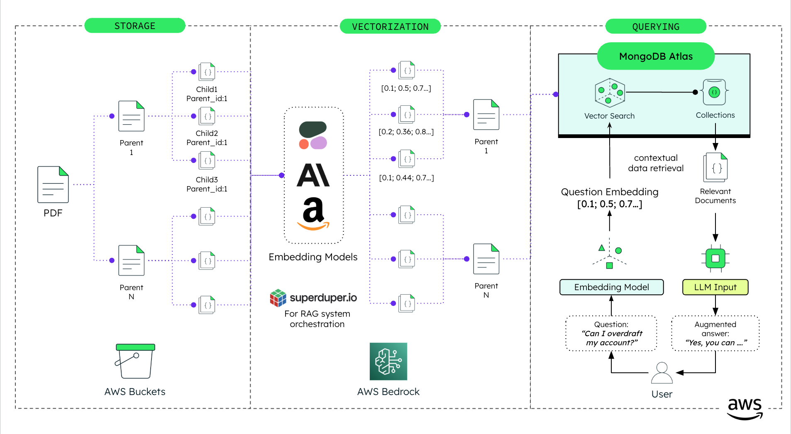

# insurance-pdf-search-

## Where MongoDB Shines?

This project leverages [MongoDB Atlas Vector Search](https://www.mongodb.com/products/platform/atlas-vector-search) to efficiently index and search unstructured data, providing fast and relevant retrieval of information. MongoDB Atlas offers robust and scalable database solutions, making it ideal for handling large volumes of data and complex queries.

## High Level Architecture



## Tech Stack

- Python `>=3.10,<3.11` for the Backend implementation.
- [MongoDB Atlas Vector Search](https://www.mongodb.com/products/platform/atlas-vector-search) for efficient data indexing and retrieval.
- AWS [Bedrock](https://aws.amazon.com/bedrock/) models for embeddings and querying.
- [Cohere English V3](https://docs.aws.amazon.com/bedrock/latest/userguide/model-parameters-embed.html) `cohere.embed-english-v3`  model for embeddings.
- [Anthropic Claude 3 Haiku](https://docs.aws.amazon.com/bedrock/latest/userguide/bedrock-runtime_example_bedrock-runtime_InvokeModel_AnthropicClaude_section.html) `anthropic.claude-3-haiku-20240307-v1:0`  model for chat completions.
- Using [Superduper](https://superduper.io/) for simplifying the integration of AI with MongoDB databases.

## Prerequisites
Before you begin, ensure you have met the following requirements:
- MongoDB Atlas account, you can create one [here](https://account.mongodb.com/account/register). Free tier is sufficient for this project.
- Python 3.10 or higher `>=3.10,<3.11` (but less than 3.11).
- AWS Account with access to mentioned Bedrock models.
- Poetry (install via [Poetry's official documentation](https://python-poetry.org/docs/#installation)).

## Setup Instructions

### Step 0: Set Up MongoDB Database and Collection

1. Log in to [MongoDB Atlas](https://account.mongodb.com/account/login) and create a new database named `insurance_pdf_search`. You can use another name if you prefer, but make sure to update the environment variables accordingly. You can use the free tier for this project.
2. Inside this database, create a collection called `default`.

### Step 1: Configure the Environment Variables for the backend

### Add environment variables

> **_Note:_** Create a .env file within the backend directory.

```bash
MONGODB_URI = ""
ARTIFACT_STORE = "data/your_project/your_demo/artifacts"
AWS_REGION = "<REPLACE_AWS_REGION>"
AWS_ACCESS_KEY_ID = ""
AWS_SECRET_ACCESS_KEY = ""
AWS_S3_ENABLED = False
AWS_S3_BUCKET = 
AWS_S3_PDF_FOLDER = 
PDF_FOLDER = "data/your_project/your_demo/pdfs"
PDFS = ["personal-banking-terms-conditions.pdf"] # Add the PDFs you want to index, make sure they are in the PDF_FOLDER
EMBEDDING_MODEL = "cohere.embed-english-v3"
CHAT_COMPLETION_MODEL = "anthropic.claude-3-haiku-20240307-v1:0"
ORIGINS=http://localhost:3000
```

### Step 2: Configure AWS Account

1. Create an AWS account if you don't have one.
2. Add the AWS Access Key ID and Secret Access Key to the environment variables in the `.env` file.
3. Grant the necessary permissions to the AWS account: `AmazonBedrockFullAccess`, but in case you enable S3, you will need to add `AmazonS3FullAccess` and `SecretsManagerReadWrite` permissions. There are some varibles in the `.env` file that you can use to enable or disable the S3 integration.

## Run it Locally

### Backend

1. (Optional) Set your project description and author information in the `pyproject.toml` file:
   ```toml
   description = "Your Description"
   authors = ["Your Name <you@example.com>"]
2. Open the project in your preferred IDE (the standard for the team is Visual Studio Code).
3. Open the Terminal within Visual Studio Code.
4. Ensure you are in the root project directory where the `makefile` is located.
5. Execute the following commands:
  - Poetry start
    ````bash
    make poetry_start
    ````
  - Poetry install
    ````bash
    make poetry_install
    ````
6. Verify that the `.venv` folder has been generated within the `/backend` directory.
7. Make sure to select the Python interpreter from the `.venv` folder. You can change this in Visual Studio Code by clicking on the Python version in the bottom left corner, or searching by `Python: Select Interpreter` in the command palette. For this project, the Python interpreter should be located at `./backend/.venv/bin/python`.

### Interact with the API

Start the server by running the following commands:
   1. Make sure to be over `/backend` directory. 
        ```bash
         cd backend
         ```
   3. Start the backend server with the following command:
        ```bash
        poetry run uvicorn main:app --host 0.0.0.0 --port 8000
        ```

**_Note:_** The server will be running on `http://localhost:8000`.


Ensure that you leave the following folders empty: `data/insurance/pdf_search/artifacts` and `data/insurance/pdf_search/pdf-images`. Delete any existing folders and files in these folders.

- Use the following endpoints to interact with the API:

   1. `POST /cleandb`: Make a request to clean the database. 
      -  Body: `{ "industry": "insurance", "demo_name": "pdf_search" }`.
   2. `POST /setuprag`: Make a request to set up the RAG model.
      -  Body: `{ "industry": "insurance", "demo_name": "pdf_search" }`.
   3. `POST /querythepdf`: Once the RAG model is set up, make a request to query the PDFs.
      -  Body: `{ "industry": "insurance", "demo_name": "pdf_search", "guidelines": "guidlines_risk_management_singapore.pdf", "query": "What are risk control measures associated with claim handling and case reserving?" }`.

**_Note:_** Above requests are made to the local server, so make sure the server is running. Make sure to execute the requests in the order mentioned above. Once the RAG model is set up, you can query the PDFs multiple times.

### To connect with Frontend

### Configure the Environment Variables for the frontend

1. In the `frontend` folder, create a `.env.local` file.
2. Add the URL for the API using the following format:

```bash
NEXT_PUBLIC_ASK_THE_PDF_API_URL="http://localhost:8000/querythepdf" // This will now be used from a different backend. This implementation is only front-end.
```

### Run the Frontend
1. Navigate to the `frontend` folder.
2. Install dependencies by running:
```bash
npm install
```
3. Start the frontend development server with:
````bash
npm run dev
````

The frontend will now be accessible at http://localhost:3000 by default, providing a user interface to interact with the image vector search demo.

## Run with Docker (Preferred)

Prerequisites:
- Docker Desktop installed on your machine.
- Docker Desktop running on your machine.

### Docker Setup Instructions

To run the application using Docker, follow these setup steps:

### Build the Application
> **_NOTE:_** If you don’t have make installed, you can install it using `sudo apt install make` or `brew install make`

1. To run with Docker use the following command:
```
make build
```
2. To delete the container and image run:
```
make clean
```

## Common errors

- Check that you've created an `.env` file that contains your valid (and working) API keys, environment and index variables.

